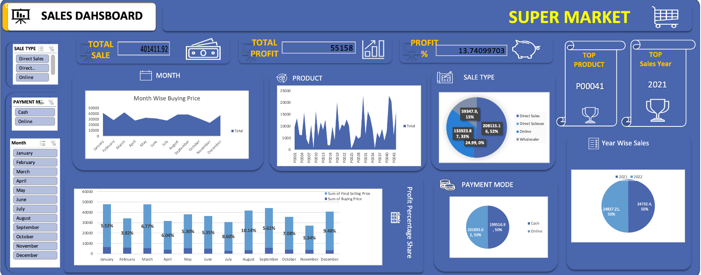

# Super Market Sales Dashboard

This repository contains a comprehensive sales dashboard for a supermarket, providing insights into sales performance, profit metrics, product analysis, and payment trends. The dashboard is designed to help businesses understand their sales data and make data-driven decisions.

---

## Key Features

### 1. **Overview Metrics**
- **Total Sales**: ₹401411.92
- **Total Profit**: ₹55158
- **Profit Percentage**: 13.74%

### 2. **Top Insights**
- **Top Product**: `P00041`
- **Top Sales Year**: `2021`

### 3. **Sales by Type**
- Distribution of sales by type:
  - **Direct Sales**: 52%
  - **Online Sales**: 33%
  - **Wholesaler**: 15%

### 4. **Payment Modes**
- **Cash**: 50%
- **Online**: 50%

### 5. **Yearly Sales Distribution**
- Sales are evenly distributed between 2021 and 2022, with 50% in each year.

### 6. **Monthly Trends**
- Monthly analysis of buying and selling prices, along with profit percentages for each month.

### 7. **Product-Wise Sales**
- Visualization of sales performance for various products.

---

## Visualizations

The dashboard includes the following visualizations:

- **Month-Wise Buying Price**: Line chart displaying monthly trends in buying prices.
- **Product-Wise Sales**: Bar chart showcasing sales for individual products.
- **Profit Percentage by Month**: Combined bar and line chart highlighting monthly profit margins.
- **Sales Type Distribution**: Pie chart showing the proportion of sales by type.
- **Payment Mode Breakdown**: Pie chart displaying the share of payment methods.
- **Yearly Sales Comparison**: Pie chart comparing sales performance across years.

---

## Contact

For any queries or contributions, please feel free to reach out:

- **Email**: [ritamganguliac@gmail.com](mailto:ritamganguliac@gmail.com)
- **LinkedIn**: [Ritam Ganguli](https://www.linkedin.com/in/ritamganguliac/)

---

## Dashboard Image

